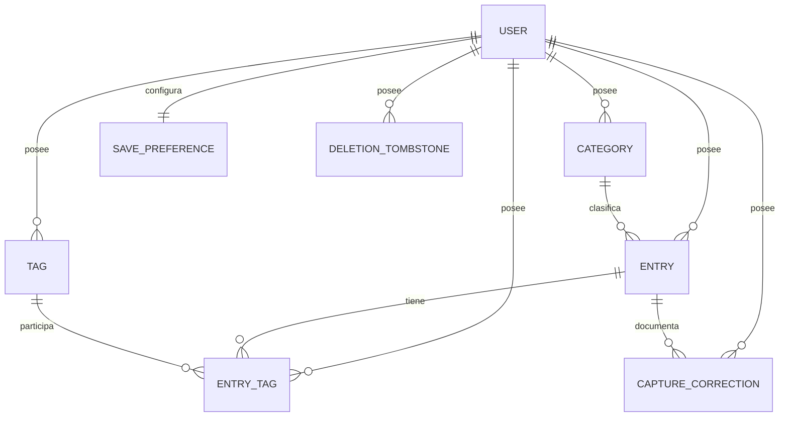

# Modelo de dominio — MVP v0.1

**Versión del contrato:** 0.1
**Estado:** acordado para el MVP

Este documento concreta el modelo mencionado por la [especificación funcional](./spec.md) y la [arquitectura técnica](./arch.md). Es el contrato de dominio común para SQLite, PostgreSQL, la API y los clientes; no prescribe nombres de tablas ni el formato del protocolo de sincronización.

## 1. Convenciones y decisiones transversales

### Identificadores offline-first

- Toda entidad que tenga un campo `id` usa un UUID v4, generado en el dispositivo que crea el registro. No se usan identificadores enteros asignados por el servidor.
- Los UUID se representan en los límites de la API como cadenas canónicas en minúsculas con guiones. PostgreSQL puede usar su tipo `uuid`; SQLite puede almacenarlos como texto.
- El servidor conserva un identificador válido recibido del cliente y rechaza una colisión. Esta regla permite crear datos sin conexión. La idempotencia, los cursores y la resolución de colisiones o conflictos se concretarán en el issue #19.

### Propiedad y aislamiento por usuario

Aunque el MVP tenga un solo usuario, todo registro de dominio, relación y metadato de borrado pertenece explícitamente a un `user_id`. Una referencia solo es válida si origen y destino tienen el mismo `user_id`; conocer un UUID ajeno nunca concede acceso. Las restricciones de unicidad indicadas «por usuario» incluyen `user_id`.

`User` es la raíz de propiedad. No se permite transferir categorías, etiquetas, entradas, preferencias ni correcciones entre usuarios. Esto evita rediseñar la persistencia al habilitar varios usuarios.

### Fechas y horas

- Todos los instantes (`*_at`) representan un instante UTC, nunca una fecha local sin zona.
- En PostgreSQL se usa un tipo consciente de zona (`timestamptz`) normalizado a UTC. En SQLite se guarda texto RFC 3339 canónico con precisión de milisegundos y sufijo `Z`, por ejemplo `2026-09-25T16:30:00.000Z`.
- La API acepta RFC 3339 con zona explícita, normaliza el valor a UTC y siempre responde con `Z`. Rechaza fechas sin zona. La interfaz convierte a la zona del dispositivo únicamente para mostrar o introducir valores.
- «Ahora» significa el reloj UTC del dispositivo que realiza primero la operación offline. La sincronización no reemplaza después ese instante por la hora del servidor.

### Mutabilidad, versiones y valores normalizados

- `mutable` significa modificable por el usuario; `sistema` significa que cambia únicamente como efecto de una operación de dominio; `inmutable` no cambia después de crear el registro.
- Todo registro sincronizable nace con `version = 1`. Una modificación persistida incrementa la versión exactamente una vez y actualiza `updated_at`; una lectura o un no-op no lo hace. El uso de la versión durante la sincronización pertenece al issue #19.
- Las claves normalizadas no se muestran. Se calculan con Unicode NFKC, recorte, conversión a minúsculas independiente del locale y colapso de espacios. Para etiquetas, los separadores `_`, `-` y espacios se colapsan además a un solo espacio. El catálogo previo sigue siendo la protección frente a sinónimos que una normalización mecánica no puede detectar.

## 2. Enumeraciones cerradas

| Tipo | Valores persistidos | Regla |
|---|---|---|
| `CategoryKind` | `STANDARD`, `TASK`, `EVENT`, `CAPTURE` | Identidad funcional estable de una categoría. |
| `TaskStatus` | `PENDING`, `IN_PROGRESS`, `DONE` | Solo para entradas cuya categoría es `TASK`. |
| `TaskRecurrence` | `ONCE`, `RECURRING` | Marca simple; no contiene calendario de repetición. |
| `SaveMode` | `FAST_FORWARD`, `PREVIEW_BEFORE_SAVE` | Preferencia global de nuevas capturas. |
| `CorrectionField` | `CATEGORY_ID`, `OCCURRED_AT`, `CONTENT`, `TAG_IDS` | Campo corregido durante la aceptación inicial. |
| `TombstoneEntity` | `CATEGORY`, `TAG`, `ENTRY`, `ENTRY_TAG`, `SAVE_PREFERENCE`, `CAPTURE_CORRECTION` | Tipo mínimo del objeto borrado. `USER` queda fuera del borrado del MVP. |

Los valores persistidos son estables y no se traducen. La interfaz puede mostrar sus nombres en español.

## 3. Entidades y campos

En las tablas, «sin valor predeterminado» significa que quien crea la entidad debe proporcionar el dato. «Ahora UTC» y los UUID se generan localmente para mantener el funcionamiento offline.

### 3.1 `User`

Cuenta que autentica y delimita todos los datos personales.

| Campo | Tipo | Requerido / valor predeterminado | Restricciones | Mutabilidad |
|---|---|---|---|---|
| `id` | UUID v4 | Requerido; generado al crear | Único global | Inmutable |
| `email` | texto | Requerido; sin valor predeterminado | Email válido; clave normalizada única global | Mutable |
| `email_normalized` | texto | Requerido; derivado de `email` | No vacío; único global; no se expone para edición | Sistema |
| `password_hash` | texto | Requerido; sin valor predeterminado | Hash producido por el algoritmo de autenticación aprobado; nunca contraseña en claro | Mutable mediante cambio de contraseña |
| `created_at` | instante UTC | Requerido; ahora UTC | No futuro más allá de tolerancia de reloj definida en implementación | Inmutable |
| `updated_at` | instante UTC | Requerido; igual a `created_at` | `updated_at >= created_at` | Sistema |
| `version` | entero positivo | Requerido; `1` | `>= 1` | Sistema |

### 3.2 `Category`

Catálogo configurable que clasifica entradas. `kind` conserva el comportamiento aunque el usuario cambie el nombre visible: renombrar «Tarea» a «Pendiente» no deja de hacerla una categoría `TASK`. Las categorías iniciales de Tarea, Evento y Captura usan respectivamente `TASK`, `EVENT` y `CAPTURE`; el resto usa `STANDARD`. Solo puede existir una categoría no borrada de cada clase especial por usuario, mientras que puede haber cualquier número de categorías `STANDARD`.

| Campo | Tipo | Requerido / valor predeterminado | Restricciones | Mutabilidad |
|---|---|---|---|---|
| `id` | UUID v4 | Requerido; generado al crear | Único global | Inmutable |
| `user_id` | UUID | Requerido; sin valor predeterminado | Referencia a `User`; propietario | Inmutable |
| `kind` | `CategoryKind` | Requerido; `STANDARD` para categorías creadas por el usuario | Una por usuario para cada valor especial; no depende de `name` | Inmutable |
| `name` | texto | Requerido; sin valor predeterminado | Tras recorte, 1–100 caracteres; clave normalizada única por usuario | Mutable |
| `name_normalized` | texto | Requerido; derivado de `name` | No vacío; único por usuario | Sistema |
| `voice_command` | texto | Requerido; sin valor predeterminado | Tras recorte, 1–100 caracteres; clave normalizada única por usuario | Mutable |
| `voice_command_normalized` | texto | Requerido; derivado de `voice_command` | No vacío; único por usuario | Sistema |
| `description` | texto | Requerido; sin valor predeterminado | Tras recorte, 1–1000 caracteres | Mutable |
| `color` | texto | Requerido; sin valor predeterminado | Color RGB hexadecimal canónico `#RRGGBB` | Mutable |
| `icon` | texto | Requerido; sin valor predeterminado | Identificador portable de icono, 1–100 caracteres | Mutable |
| `created_at` | instante UTC | Requerido; ahora UTC | — | Inmutable |
| `updated_at` | instante UTC | Requerido; igual a `created_at` | `updated_at >= created_at` | Sistema |
| `version` | entero positivo | Requerido; `1` | `>= 1` | Sistema |

Cambiar `kind` requeriría transformar o invalidar entradas existentes, por lo que no es una edición admitida. Una entrada adquiere semántica de tarea, evento o captura a través del `kind` de su categoría, nunca comparando nombres traducibles.

### 3.3 `Tag`

Elemento de un catálogo plano y previamente creado para clasificación transversal.

| Campo | Tipo | Requerido / valor predeterminado | Restricciones | Mutabilidad |
|---|---|---|---|---|
| `id` | UUID v4 | Requerido; generado al crear | Único global | Inmutable |
| `user_id` | UUID | Requerido; sin valor predeterminado | Referencia al propietario `User` | Inmutable |
| `name` | texto | Requerido; sin valor predeterminado | Tras recorte, 1–100 caracteres | Mutable |
| `name_normalized` | texto | Requerido; derivado de `name` | No vacío; único por usuario | Sistema |
| `created_at` | instante UTC | Requerido; ahora UTC | — | Inmutable |
| `updated_at` | instante UTC | Requerido; igual a `created_at` | `updated_at >= created_at` | Sistema |
| `version` | entero positivo | Requerido; `1` | `>= 1` | Sistema |

Las etiquetas no tienen jerarquía. Una entrada solo puede enlazar etiquetas existentes del mismo usuario; texto libre no crea una etiqueta implícitamente.

### 3.4 `Entry`

Unidad de información. Tarea, evento y captura no son subtipos físicos: son entradas cuya categoría tiene el `kind` correspondiente.

| Campo | Tipo | Requerido / valor predeterminado | Restricciones | Mutabilidad |
|---|---|---|---|---|
| `id` | UUID v4 | Requerido; generado al crear | Único global | Inmutable |
| `user_id` | UUID | Requerido; sin valor predeterminado | Referencia al propietario `User` | Inmutable |
| `category_id` | UUID | Requerido; sin valor predeterminado | `Category` existente del mismo usuario | Mutable |
| `occurred_at` | instante UTC o `null` | Condicional; véase debajo | `null` únicamente cuando la categoría es `TASK` | Mutable |
| `content` | texto | Requerido; sin valor predeterminado | Tras recorte, 1–10000 caracteres | Mutable |
| `task_status` | `TaskStatus` o `null` | Para `TASK`: requerido, `PENDING`; para otras: `null` | No nulo solo y siempre para `TASK` | Mutable |
| `task_recurrence` | `TaskRecurrence` o `null` | Para `TASK`: requerido, `ONCE`; para otras: `null` | No nulo solo y siempre para `TASK` | Mutable |
| `capture_session_id` | UUID v4 o `null` | Opcional; `null` | Mismo UUID en todas las correcciones de la aceptación inicial; se genera al iniciar un flujo hablado o mixto | Inmutable tras guardar |
| `created_at` | instante UTC | Requerido; ahora UTC | — | Inmutable |
| `updated_at` | instante UTC | Requerido; igual a `created_at` | `updated_at >= created_at` | Sistema |
| `version` | entero positivo | Requerido; `1` | `>= 1` | Sistema |

Reglas de fecha:

- Una entrada `STANDARD`, `EVENT` o `CAPTURE` siempre termina guardada con `occurred_at`. Si la persona omite la fecha, se aplica ahora UTC antes de guardar.
- En una entrada `TASK`, omitir la fecha conserva `occurred_at = null`; no se sustituye por ahora. Esas tareas aparecen en Tareas pendientes y no en el calendario. Una tarea fechada sí aparece en el calendario.
- Cambiar `category_id` valida atómicamente las invariantes del nuevo `kind`. Al pasar a `TASK`, se inicializan estado y recurrencia si faltan y se puede conservar o retirar la fecha. Al salir de `TASK`, se exige una fecha (ahora si la persona la omitió) y se limpian ambos campos de tarea.

Estados y transiciones de tarea:

| Desde | Hacia permitidos | Significado |
|---|---|---|
| `PENDING` | `IN_PROGRESS`, `DONE` | Empezar o completar directamente |
| `IN_PROGRESS` | `PENDING`, `DONE` | Pausar o completar |
| `DONE` | `PENDING`, `IN_PROGRESS` | Reabrir pendiente o en curso |

Asignar el mismo estado es un no-op y no crea versión. No se permiten estados fuera de la enumeración. `RECURRING` es solo una marca en v0.1: no crea instancias ni define frecuencia automáticamente.

### 3.5 `EntryTag`

Relación explícita entre una entrada y una etiqueta.

| Campo | Tipo | Requerido / valor predeterminado | Restricciones | Mutabilidad |
|---|---|---|---|---|
| `id` | UUID v4 | Requerido; generado al enlazar | Único global | Inmutable |
| `user_id` | UUID | Requerido; sin valor predeterminado | Mismo propietario que entrada y etiqueta | Inmutable |
| `entry_id` | UUID | Requerido; sin valor predeterminado | Referencia a `Entry` del mismo usuario | Inmutable |
| `tag_id` | UUID | Requerido; sin valor predeterminado | Referencia a `Tag` del mismo usuario | Inmutable |
| `created_at` | instante UTC | Requerido; ahora UTC | — | Inmutable |
| `updated_at` | instante UTC | Requerido; igual a `created_at` | Igual a `created_at`; se incluye por contrato sincronizable uniforme | Sistema |
| `version` | entero positivo | Requerido; `1` | Siempre `1`; quitar y volver a añadir crea una relación nueva | Inmutable |

El par (`entry_id`, `tag_id`) es único. Quitar una etiqueta elimina la relación; no elimina ni la entrada ni la etiqueta.

### 3.6 `SavePreference`

Preferencia global de guardado de nuevas capturas. Es una entidad uno-a-uno separada para que pueda persistirse y sincronizarse sin mezclar autenticación con preferencias.

| Campo | Tipo | Requerido / valor predeterminado | Restricciones | Mutabilidad |
|---|---|---|---|---|
| `id` | UUID v4 | Requerido; generado al crear usuario | Único global | Inmutable |
| `user_id` | UUID | Requerido; sin valor predeterminado | Referencia única a `User`; exactamente una preferencia por usuario | Inmutable |
| `mode` | `SaveMode` | Requerido; `FAST_FORWARD` | Solo los dos valores cerrados | Mutable |
| `created_at` | instante UTC | Requerido; ahora UTC | — | Inmutable |
| `updated_at` | instante UTC | Requerido; igual a `created_at` | `updated_at >= created_at` | Sistema |
| `version` | entero positivo | Requerido; `1` | `>= 1` | Sistema |

Se elige `FAST_FORWARD` como valor predeterminado porque el principio del producto prioriza captura rápida. `PREVIEW_BEFORE_SAVE` aplica a todas las capturas nuevas hasta cambiar la preferencia; no altera entradas ya guardadas.

### 3.7 `CaptureCorrection`

Hecho analítico inmutable que conserva una diferencia entre lo interpretado y lo aceptado durante una captura hablada o mixta. Hay una fila por campo diferente.

| Campo | Tipo | Requerido / valor predeterminado | Restricciones | Mutabilidad |
|---|---|---|---|---|
| `id` | UUID v4 | Requerido; generado al aceptar | Único global | Inmutable |
| `user_id` | UUID | Requerido; sin valor predeterminado | Mismo propietario que la entrada | Inmutable |
| `entry_id` | UUID | Requerido; sin valor predeterminado | Referencia a la `Entry` final | Inmutable |
| `capture_session_id` | UUID v4 | Requerido; sin valor predeterminado | Igual al de `Entry`; agrupa una única aceptación | Inmutable |
| `field` | `CorrectionField` | Requerido; sin valor predeterminado | Una fila por campo y sesión | Inmutable |
| `interpreted_value` | valor JSON tipado, puede ser `null` | Propiedad requerida; sin valor predeterminado | Tipo correspondiente a `field` | Inmutable |
| `accepted_value` | valor JSON tipado, puede ser `null` | Propiedad requerida; sin valor predeterminado | Tipo correspondiente a `field`; distinto del interpretado tras canonicalizar | Inmutable |
| `created_at` | instante UTC | Requerido; ahora UTC | Instante de aceptación inicial | Inmutable |
| `updated_at` | instante UTC | Requerido; igual a `created_at` | Igual a `created_at` | Sistema |
| `version` | entero positivo | Requerido; `1` | Siempre `1` | Inmutable |

Forma canónica de los valores:

| `field` | Tipo de ambos valores |
|---|---|
| `CATEGORY_ID` | UUID como cadena o `null` |
| `OCCURRED_AT` | RFC 3339 UTC con `Z` o `null` |
| `CONTENT` | cadena o `null` |
| `TAG_IDS` | lista de UUID únicos, ordenada lexicográficamente, o `null` |

La entrada y sus correcciones se guardan en una sola transacción; los valores aceptados coinciden con el estado inicial de la entrada. Solo el formulario de aceptación inicial crea correcciones. Una edición posterior —incluido el acceso «corregir» ofrecido después de Fast Forward— modifica `Entry`/`EntryTag`, pero nunca crea ni modifica `CaptureCorrection`. La corrección registra evidencia y no vuelve a aplicar cambios sobre la entrada.

### 3.8 `DeletionTombstone`

Metadato técnico mínimo que permite propagar un borrado offline sin conservar el objeto borrado.

| Campo | Tipo | Requerido / valor predeterminado | Restricciones | Mutabilidad |
|---|---|---|---|---|
| `id` | UUID v4 | Requerido; generado al borrar | Único global | Inmutable |
| `user_id` | UUID | Requerido; sin valor predeterminado | Propietario del objeto borrado | Inmutable |
| `entity_type` | `TombstoneEntity` | Requerido; sin valor predeterminado | Tipo cerrado | Inmutable |
| `entity_id` | UUID | Requerido; sin valor predeterminado | Identificador del objeto ya ausente | Inmutable |
| `deleted_at` | instante UTC | Requerido; ahora UTC | Instante efectivo del borrado | Inmutable |
| `deleted_version` | entero positivo | Requerido; versión anterior + 1 | `>= 2` | Inmutable |

El par (`user_id`, `entity_type`, `entity_id`) es único. Al borrar, la fila activa y sus datos de negocio desaparecen físicamente; las relaciones dependientes se eliminan en la misma transacción. No hay papelera, consulta, restauración ni contenido recuperable. El tombstone no guarda nombre, contenido, relaciones ni valores anteriores, y no se presenta como la entidad al usuario: por eso el borrado sigue siendo definitivo desde el producto.

El tombstone se conserva solo el tiempo necesario para comunicar el borrado a otros dispositivos. El protocolo, acuses, retención y purga segura se definen en el issue #19; purgarlo antes de esos acuses podría resucitar datos y queda prohibido.

## 4. Relaciones y cardinalidades



| Origen | Relación | Destino | Cardinalidad y regla |
|---|---|---|---|
| `User` | posee | `Category` | 1 a 0..N; una entrada no puede usar categoría de otro usuario |
| `User` | posee | `Tag` | 1 a 0..N |
| `User` | posee | `Entry` | 1 a 0..N |
| `User` | posee | `EntryTag` | 1 a 0..N; explicita el aislamiento de la relación N a N |
| `User` | configura | `SavePreference` | 1 a 1; se crea junto al usuario |
| `User` | posee | `CaptureCorrection` | 1 a 0..N; siempre sobre una entrada propia |
| `User` | conserva | `DeletionTombstone` | 1 a 0..N; metadato técnico de objetos propios |
| `Category` | clasifica | `Entry` | 1 a 0..N; cada entrada tiene exactamente una categoría |
| `Entry` | se etiqueta mediante | `EntryTag` | 1 a 0..N |
| `Tag` | se usa mediante | `EntryTag` | 1 a 0..N; la relación materializa N a N |
| `Entry` | documenta aceptación con | `CaptureCorrection` | 1 a 0..N; solo diferencias de la sesión inicial |

No se puede eliminar una categoría mientras existan entradas que la referencien: primero deben reclasificarse o eliminarse. Eliminar una etiqueta retira sus `EntryTag` en la misma transacción. Eliminar una entrada elimina sus `EntryTag` y correcciones; en todos los casos sincronizables se producen los tombstones mínimos correspondientes.

## 5. Operaciones e invariantes de agregado

1. Crear o editar una entrada valida conjuntamente categoría, etiquetas, fecha y campos de tarea bajo el mismo `user_id`.
2. La categoría determina las invariantes especiales por su `kind`; el texto de `name` nunca determina comportamiento.
3. Una captura normal genera exactamente una `Entry`. Una entrada de categoría `CAPTURE` también es una sola entrada, aunque su contenido sea libre y pueda procesarse en el futuro.
4. Confirmar Preview Before Save guarda la entrada, sus relaciones y las diferencias de interpretación atómicamente. Cancelar no crea entrada, relación ni corrección residual.
5. Fast Forward guarda directamente los valores interpretados válidos. Cualquier cambio posterior es una edición ordinaria.
6. El borrado de cara al usuario es físico e irreversible; solo sobrevive el tombstone mínimo para evitar reapariciones durante sincronización.

## 6. Ejemplos completos

Los UUID son ilustrativos pero válidos. Todos los ejemplos pertenecen al usuario `11111111-1111-4111-8111-111111111111`.

### 6.1 Entrada normal con fecha y etiquetas

La categoría `Aprendizaje` tiene `kind = STANDARD`; las etiquetas `IA` y `Salud` ya existen.

```json
{
  "entry": {
    "id": "aaaaaaaa-aaaa-4aaa-8aaa-aaaaaaaaaaaa",
    "user_id": "11111111-1111-4111-8111-111111111111",
    "category_id": "22222222-2222-4222-8222-222222222222",
    "occurred_at": "2026-09-24T16:00:00.000Z",
    "content": "He aprendido cómo funciona el EEG.",
    "task_status": null,
    "task_recurrence": null,
    "capture_session_id": null,
    "created_at": "2026-09-24T16:02:00.000Z",
    "updated_at": "2026-09-24T16:02:00.000Z",
    "version": 1
  },
  "entry_tags": [
    {
      "id": "bbbbbbbb-bbbb-4bbb-8bbb-bbbbbbbbbbbb",
      "user_id": "11111111-1111-4111-8111-111111111111",
      "entry_id": "aaaaaaaa-aaaa-4aaa-8aaa-aaaaaaaaaaaa",
      "tag_id": "33333333-3333-4333-8333-333333333333",
      "created_at": "2026-09-24T16:02:00.000Z",
      "updated_at": "2026-09-24T16:02:00.000Z",
      "version": 1
    },
    {
      "id": "cccccccc-cccc-4ccc-8ccc-cccccccccccc",
      "user_id": "11111111-1111-4111-8111-111111111111",
      "entry_id": "aaaaaaaa-aaaa-4aaa-8aaa-aaaaaaaaaaaa",
      "tag_id": "44444444-4444-4444-8444-444444444444",
      "created_at": "2026-09-24T16:02:00.000Z",
      "updated_at": "2026-09-24T16:02:00.000Z",
      "version": 1
    }
  ]
}
```

### 6.2 Tarea sin fecha

La categoría referenciada tiene `kind = TASK`. `occurred_at = null` hace que aparezca en Tareas pendientes; `RECURRING` no genera por sí solo una próxima tarea.

```json
{
  "id": "dddddddd-dddd-4ddd-8ddd-dddddddddddd",
  "user_id": "11111111-1111-4111-8111-111111111111",
  "category_id": "55555555-5555-4555-8555-555555555555",
  "occurred_at": null,
  "content": "Revisar las plantas del balcón.",
  "task_status": "PENDING",
  "task_recurrence": "RECURRING",
  "capture_session_id": null,
  "created_at": "2026-09-25T07:15:00.000Z",
  "updated_at": "2026-09-25T07:15:00.000Z",
  "version": 1
}
```

### 6.3 Captura corregida antes de guardar

En Preview Before Save, el parser interpretó categoría Recuerdo y las 18:00, pero el usuario aceptó Momento bonito y las 19:00. La entrada ya contiene los valores aceptados; las correcciones solo documentan la diferencia.

```json
{
  "entry": {
    "id": "eeeeeeee-eeee-4eee-8eee-eeeeeeeeeeee",
    "user_id": "11111111-1111-4111-8111-111111111111",
    "category_id": "77777777-7777-4777-8777-777777777777",
    "occurred_at": "2026-09-25T17:00:00.000Z",
    "content": "Cena viendo la ciudad iluminada.",
    "task_status": null,
    "task_recurrence": null,
    "capture_session_id": "66666666-6666-4666-8666-666666666666",
    "created_at": "2026-09-25T17:01:00.000Z",
    "updated_at": "2026-09-25T17:01:00.000Z",
    "version": 1
  },
  "corrections": [
    {
      "id": "88888888-8888-4888-8888-888888888888",
      "user_id": "11111111-1111-4111-8111-111111111111",
      "entry_id": "eeeeeeee-eeee-4eee-8eee-eeeeeeeeeeee",
      "capture_session_id": "66666666-6666-4666-8666-666666666666",
      "field": "CATEGORY_ID",
      "interpreted_value": "99999999-9999-4999-8999-999999999999",
      "accepted_value": "77777777-7777-4777-8777-777777777777",
      "created_at": "2026-09-25T17:01:00.000Z",
      "updated_at": "2026-09-25T17:01:00.000Z",
      "version": 1
    },
    {
      "id": "12121212-1212-4212-8212-121212121212",
      "user_id": "11111111-1111-4111-8111-111111111111",
      "entry_id": "eeeeeeee-eeee-4eee-8eee-eeeeeeeeeeee",
      "capture_session_id": "66666666-6666-4666-8666-666666666666",
      "field": "OCCURRED_AT",
      "interpreted_value": "2026-09-25T16:00:00.000Z",
      "accepted_value": "2026-09-25T17:00:00.000Z",
      "created_at": "2026-09-25T17:01:00.000Z",
      "updated_at": "2026-09-25T17:01:00.000Z",
      "version": 1
    }
  ]
}
```

Si al día siguiente se edita el contenido, solo cambian `Entry.content`, `Entry.updated_at` y `Entry.version`; estas dos correcciones permanecen inmutables y no se crea una tercera.

## 7. Límites de esta versión

Este modelo fija entidades, tipos, invariantes y semántica de borrado necesarios para implementar el MVP. El issue #19 debe decidir el contrato de transporte de sincronización: lotes, cursores, idempotencia, acuses de tombstones, retención, detección y representación de conflictos. No debe redefinir las reglas de dominio aquí descritas.
